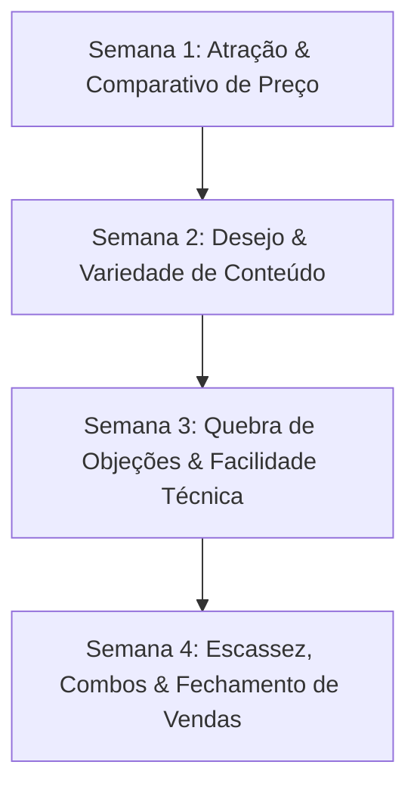

# 📅 Cronograma de 30 Dias para Instagram Feed (4:5 — 1080 x 1350 px)
### **DezPila Streaming — Estratégia de Captação de Leads & Conversão Direta**

---

## 🎨 Guia de Estilo Visual (Identidade do Site DezPila)

* **Dimensão Mandatória**: `1080 x 1350 pixels` (Proporção 4:5 — preenche a tela do celular no feed).
* **Paleta de Cores**:
  * **Fundo**: Preto Absoluto (`#000000`), Dark Card (`#0D0D11`), Borda Escura (`#1A0507`).
  * **Destaques & Ação**: Vermelho Crimson (`#970202`), Glow Neon (`rgba(151,2,2,0.8)`).
  * **Textos**: Branco Puro (`#FFFFFF`) para títulos; Cinza Prata (`#A1A1AA`) para detalhes.
* **Tipografia**: Títulos em Caixa Alta (Bold/Black), fontes modernas (Inter / Montserrat / Outfit).
* **Elementos de Design**: Bordas com gradiente de energia vermelho, mockups de Smart TVs e celulares flutuantes com efeito glassmorphism e sombras profundas.
* **Linguagem / Tom**: Direto, provocativo, focado na economia imediata, urgência e praticidade.

---

## 🚀 Estrutura da Estratégia dos 30 Dias

---

## 📌 SEMANA 1 — Atração & Conscientização da Dor (Comparativo de Preço)

### 🗓️ Dia 1: O Choque da Fatura
* **Formato**: Card Estático (1080x1350 px)
* **Visual**: Fundo preto com a imagem de uma fatura de cartão acumulando Netflix, GloboPlay, HBO Max e Premiere totalizando R$ 347/mês riscados em vermelho, ao lado de um badge neon brilhante `#970202`: "DezPila: R$ 10,00/mês".
* **Headline na Arte**: *"POR QUE PAGAR R$ 350 SE VOCÊ PODE PAGAR R$ 10?"*
* **Legenda**:
  Você já parou para somar quanto gasta por mês mantendo 4 ou 5 assinaturas de streaming diferentes só para assistir a seus jogos e séries favoritos?
  💸 Netflix + GloboPlay + Disney+ + Premiere = R$ 347,00/mês.
  🔥 **DezPila Streaming = R$ 10,00/mês.**
  Acesse todos os filmes, séries, canais abertos e esportes ao vivo em 4K em uma única plataforma sem fidelidade.
  👉 Clique no link da bio e ative seu acesso em 2 minutos!
* **Hashtags**: `#DezPila #StreamingBrasil #Economia #FutebolAoVivo #FilmesESeries`

---

### 🗓️ Dia 2: Comparativo Lado a Lado (Tabela da Verdade)
* **Formato**: Infográfico / Carrossel (1080x1350 px)
* **Visual**: Tabela escura com bordas de luz vermelha `#970202`. Coluna da esquerda: "Outros Serviços" (Preço alto, 1 tela, catálogo picado). Coluna da direita (DezPila): R$ 10/mês, +60 mil conteúdos, Qualidade 4K, Suporte 24/7.
* **Headline na Arte**: *"A TABELA QUE AS OPERADORAS NÃO QUEREM QUE VOCÊ VEJA"*
* **Legenda**:
  A conta não mente! Por que continuar limitado quando você pode ter entretenimento ilimitado pelo preço de um cafezinho?
  Com o DezPila você garante:
  ✅ +60.000 conteúdos em 4K/FHD
  ✅ Todos os canais de esportes ao vivo liberados
  ✅ Guia de programação (EPG)
  ✅ Funciona na sua TV, celular ou computador
  Comente "EU QUERO" ou acesse o link na bio para testar agora.
* **Hashtags**: `#Economizar #TVPorAssinatura #SmartTV #DezPila`

---

### 🗓️ Dia 3: Cancela o que te Custa Caro
* **Formato**: Imagem Única com Efeito Neon (1080x1350 px)
* **Visual**: Mão segurando um smartphone mostrando a tela do site DezPila com o botão vermelho "ASSINAR AGORA POR R$ 10". Ao fundo, fundo preto limpo com iluminação radial vermelha.
* **Headline na Arte**: *"CANCELAR A TV A CABO FOI A MELHOR DECISÃO DO MEU ANO."*
* **Legenda**:
  Quem experimenta o DezPila nunca mais volta a pagar R$ 200 numa fatura de TV a cabo.
  Liberdade é ter todos os canais de esportes, filmes recém-saídos do cinema e séries completas por apenas R$ 10 por mês.
  Sem contrato de fidelidade. Cancele quando quiser.
  🔗 Link oficial de ativação no perfil!
* **Hashtags**: `#CancelaATV #DezPilaStreaming #FutebolNoPremiere #FilmesOnline`

---

### 🗓️ Dia 4: Quanto Custa o Seu Final de Semana?
* **Formato**: Carrossel 2 Lâminas (1080x1350 px)
* **Visual**: Lâmina 1: Ingresso do cinema + Pipoca = R$ 90. Lâmina 2: Imagem do site DezPila na TV com pipoca no sofá = R$ 10/mês com toda a família.
* **Headline na Arte**: *"CINEMA EM CASA POR R$ 10 POR MÊS"*
* **Legenda**:
  Um combo de cinema para duas pessoas ultrapassa facilmente os R$ 100.
  No DezPila, com apenas R$ 10,00 você assiste aos lançamentos do cinema no conforto do seu sofá, em 4K e sem comerciais.
  Garanta seu acesso agora mesmo pelo link da bio!
* **Hashtags**: `#CinemaEmCasa #PipocaESerie #DezPila #Filmes4K`

---

### 🗓️ Dia 5: Sexta-Feira de Futebol Ao Vivo
* **Formato**: Card de Alta Impacto (1080x1350 px)
* **Visual**: Jogador de futebol em destaque com iluminação vermelha `#970202` e fundo de estádio lotado. TV no canto exibindo a transmissão límpida sem travamentos.
* **Headline na Arte**: *"NÃO PERCA NENHUM LANCE DO SEU TIME POR R$ 10/MÊS"*
* **Legenda**:
  Rodada decisiva chegando e você vai ficar procurando link travado na internet?
  No DezPila você assiste a todos os jogos do Campeonato Brasileiro, Copa do Brasil e Libertadores com imagem 4K e zero travamento.
  ⚡ Ativação imediata em 2 minutos. Chama no direct ou acesse a bio!
* **Hashtags**: `#FutebolAoVivo #Brasileirao #PremiereAoVivo #DezPila`

---

### 🗓️ Dia 6: O Mitos vs. Fatos do Streaming
* **Formato**: Carrossel Educativo (1080x1350 px)
* **Visual**: Estilo Dark Mode, perguntas em caixas cinza escuro `#0D0D11` e respostas com checkmark vermelho `#970202`.
* **Headline na Arte**: *"MITO VS. FATO: DEZPILA R$ 10/MÊS"*
* **Legenda**:
  ❌ Mito: "Por R$ 10 deve travar toda hora."
  ✅ FATO: Servidores dedicados de alta performance com estabilidade garantida!
  ❌ Mito: "É difícil de instalar."
  ✅ FATO: Instalação em menos de 2 minutos no celular ou Smart TV.
  Chega de dúvidas! Teste hoje mesmo clicando no link da bio.
* **Hashtags**: `#Tecnologia #StreamingEstavel #DezPila #MitoOuFato`

---

### 🗓️ Dia 7: Resumo da Semana — A Decisão É Sua
* **Formato**: Card com Botão Fictício "PLAY" (1080x1350 px)
* **Visual**: Design minimalista preto e vermelho. Centralizado: "Você prefere continuar pagando R$ 300 ou mudar para R$ 10?".
* **Headline na Arte**: *"A SUA ÚNICA DÚVIDA É POR QUE NÃO ASSINOU ANTES."*
* **Legenda**:
  Mais de milhares de clientes já economizaram este mês e estão aproveitando mais de 60.000 conteúdos sem pagar fortunas.
  Você vai continuar jogando dinheiro fora?
  👉 Acesse o link da bio e assine seu plano DezPila agora!
* **Hashtags**: `#Decisao #EconomiaDomestica #DezPila #Streaming`

---

## 🎬 SEMANA 2 — Desejo, Prova Social & Variedade de Conteúdo

### 🗓️ Dia 8: O Maior Catálogo da Internet
* **Formato**: Mockup Múltiplo (1080x1350 px)
* **Visual**: Grade com capas dos filmes e séries mais quentes do momento (lançamentos 2026), com o logo DezPila em destaque com aura vermelha.
* **Headline na Arte**: *"+60.000 CONTEÚDOS NA PALMA DA SUA MÃO"*
* **Legenda**:
  Filmes do cinema, séries atualizadas diariamente, novelas, desenhos para as crianças e todos os canais fechados liberados.
  Tudo organizado por categorias no seu app.
  Assine por R$ 10,00/mês e tenha entretenimento infinito! Link na bio.
* **Hashtags**: `#FilmesESeries #Maratonar #DezPila #Lancamentos`

---

### 🗓️ Dia 9: Depoimento Real de Cliente
* **Formato**: Card com Print Estilizado de WhatsApp (1080x1350 px)
* **Visual**: Fundo escuro com um balão de mensagem estilizado em vidro (glassmorphism) com borda vermelha: *"Cara, sensacional! Pegou direto na minha TV Samsung em 2 minutos. Adeus TV a cabo!"*
* **Headline na Arte**: *"O QUE NOSSOS CLIENTES DIZEM SOBRE O DEZPILA"*
* **Legenda**:
  Quem testa, aprova na hora! A satisfação dos nossos assinantes é a nossa maior garantia.
  Faça como centenas de pessoas que simplificaram a forma de assistir TV.
  👉 Link de ativação rápida disponível na bio!
* **Hashtags**: `#ClientesSatisfeitos #Depoimento #DezPila #Qualidade`

---

### 🗓️ Dia 10: Maratonando Séries no Fim de Semana
* **Formato**: Card Lifestyle / Sofá (1080x1350 px)
* **Visual**: Sala escura com ambientação de iluminação LED vermelha atrás da Smart TV exibindo o menu do DezPila.
* **Headline na Arte**: *"PRONTO PARA A MARATONA DO FINAL DE SEMANA?"*
* **Legenda**:
  Série nova lançada? Temporada completa liberada?
  No DezPila você não precisa assinar 3 plataformas diferentes para acompanhar suas séries preferidas. Está tudo em um só lugar!
  Garanta seu acesso agora por apenas R$ 10,00/mês clicando na bio.
* **Hashtags**: `#MaratonaDeSeries #Sextou #DezPila #Series4K`

---

### 🗓️ Dia 11: Canais Infantis para a Criançada
* **Formato**: Card Temático Familiar (1080x1350 px)
* **Visual**: Destaque para desenhos e canais infantis em alta definição na tela da TV com visual escuro elegante.
* **Headline na Arte**: *"DIVERSÃO GARANTIDA PARA TODA A FAMÍLIA"*
* **Legenda**:
  O DezPila também pensa nos pequenos! Canais infantis 24 horas, filmes animados e séries educativas organizados com total praticidade.
  Tudo isso no mesmo plano familiar por R$ 10/mês.
  🔗 Acesse o link da bio e assine já!
* **Hashtags**: `#DesenhosInfantis #Familia #DezPila #Kids`

---

### 🗓️ Dia 12: Qualidade 4K Ultra HD
* **Formato**: Card Focado em Tecnologia (1080x1350 px)
* **Visual**: Ícone cintilante `4K ULTRA HD` em dourado/vermelho `#970202` sobre fundo preto brilhante com zoom em textura de alta definição.
* **Headline na Arte**: *"IMAGEM TÃO CRISP QUE VOCÊ SENTE QUE ESTÁ LÁ"*
* **Legenda**:
  Esqueça transmissões embaçadas e quadriculadas. O DezPila entrega sinal em alta resolução 4K e Full HD com tecnologia de compressão avançada.
  Assista aos seus esportes e filmes com nitidez cristalina!
  👉 Ative agora na bio por apenas R$ 10.
* **Hashtags**: `#Qualidade4K #UltraHD #DezPila #Tecnologia`

---

### 🗓️ Dia 13: Custo Benefício Imbatível (Calculadora)
* **Formato**: Infográfico Dinâmico (1080x1350 px)
* **Visual**: Ilustração de moedas de R$ 0,33 por dia caindo numa TV com brilho vermelho.
* **Headline na Arte**: *"APENAS R$ 0,33 POR DIA!"*
* **Legenda**:
  R$ 10 por mês significa menos de 35 centavos por dia para ter acesso ao maior catálogo de entretenimento da internet.
  Menos que um pãozinho na padaria para ter futebol, filmes e séries liberados 24h.
  O que você está esperando? Link no perfil!
* **Hashtags**: `#CustoBeneficio #Economia #DezPila #Oferta`

---

### 🗓️ Dia 14: Plantão de Esportes Ao Vivo
* **Formato**: Card Noticioso / Esportivo (1080x1350 px)
* **Visual**: Imagem de bola de futebol pegando fogo em tom vermelho crimson `#970202` com relógio regressivo.
* **Headline na Arte**: *"HOJE TEM JOGÃO! VOCÊ JÁ GARANTIU SUA TELA?"*
* **Legenda**:
  Dia de jogo grande! Não passe raiva com travamentos no meio do segundo tempo.
  No DezPila você assiste aos jogos do seu time com estabilidade total e máxima qualidade de imagem.
  ⚡ Ative em menos de 2 minutos pelo link da bio!
* **Hashtags**: `#DiaDeJogo #FutebolHoje #DezPila #EsportesAoVivo`

---

## 🛠️ SEMANA 3 — Quebra de Objeções & Facilidade Técnica

### 🗓️ Dia 15: Compatibilidade Total (Qualquer Aparelho)
* **Formato**: Card Multi-Dispositivos (1080x1350 px)
* **Visual**: Composição mostrando Smart TV, Smartphone Android/iOS, Notebook e TV Box todos rodando a plataforma DezPila em sincronia.
* **Headline na Arte**: *"FUNCIONA EM QUALQUER TELA QUE VOCÊ TIVER"*
* **Legenda**:
  "Preciso comprar algum aparelho especial?" NÃO!
  O DezPila funciona na sua Smart TV (Samsung, LG, TCL, Android TV), no celular, tablet, computador ou TV Box.
  Simples assim. Baixou, conectou, assistiu!
  👉 Link oficial de suporte e cadastro na bio.
* **Hashtags**: `#SmartTV #Android #iOS #TVBox #DezPila`

---

### 🗓️ Dia 16: Passo a Passo de Instalação (2 Minutos)
* **Formato**: Carrossel 3 Passos (1080x1350 px)
* **Visual**:
  Lâmina 1: Passo 1 — Clique no link da Bio.
  Lâmina 2: Passo 2 — Escolha seu plano (R$ 10).
  Lâmina 3: Passo 3 — Receba o acesso instantâneo no PIX.
* **Headline na Arte**: *"COMO ATIVAR SEU DEZPILA EM 3 PASSOS FÁCEIS"*
* **Legenda**:
  Sem burocracia, sem esperar técnico ir na sua casa, sem passar fios pela sala.
  Em menos de 2 minutos você conclui o cadastro e já está assistindo na sua TV.
  Quer testar agora? Clique no link do nosso perfil!
* **Hashtags**: `#PassoAPasso #InstalacaoRapida #DezPila #Praticidade`

---

### 🗓️ Dia 17: Pix Nativo & Instantâneo
* **Formato**: Card Destaque de Segurança (1080x1350 px)
* **Visual**: Modal nativo do site exibindo o QR Code PIX com badge verde de aprovação instantânea e borda vermelha neon `#970202`.
* **Headline na Arte**: *"PAGAMENTO NO PIX: LIBERAÇÃO EM SEGUNDOS"*
* **Legenda**:
  Nosso checkout é 100% nativo e seguro! Gerou o QR Code PIX, pagou, o sistema reconhece automaticamente e libera seu acesso na mesma hora.
  Sem espera e sem complicação.
  🔗 Acesse a bio e ative seu acesso PIX agora!
* **Hashtags**: `#PixInstantaneo #CheckoutSeguro #DezPila #Seguranca`

---

### 🗓️ Dia 18: Sem Contrato de Fidelidade
* **Formato**: Card Conceitual Minimalista (1080x1350 px)
* **Visual**: Um papel de contrato sendo rasgado com luz vermelha dramática de fundo e o texto "SEM FIDELIDADE".
* **Headline na Arte**: *"LIBERDADE TOTAL: CANCELE QUANDO QUISER"*
* **Legenda**:
  Sabe aquelas operadoras tradicionais que te prendem por 12 meses com multas abusivas? Aqui isso NÃO existe.
  No DezPila você assina mês a mês. Gostou, continua. Não quer mais, cancela sem pagar 1 centavo de multa.
  Experimente a verdadeira liberdade no link da bio!
* **Hashtags**: `#SemFidelidade #Liberdade #DezPila #StreamingSemApresentar`

---

### 🗓️ Dia 19: Suporte Humano via WhatsApp
* **Formato**: Card de Atendimento (1080x1350 px)
* **Visual**: Ícone de WhatsApp brilhante ao lado de um operador especialista pronto para ajudar em um fundo Dark Premium.
* **Headline na Arte**: *"PRECISA DE AJUDA? NOSSO SUPORTE TE ATENDE EM SEGUNDOS"*
* **Legenda**:
  Dúvidas na hora de configurar na sua TV?
  Nossa equipe de suporte técnico especializado atende você direto pelo WhatsApp para garantir que tudo funcione perfeitamente.
  Você nunca fica na mão.
  👉 Venha tirar suas dúvidas pelo link da bio!
* **Hashtags**: `#SuporteVIP #WhatsApp #DezPila #AtendimentoHumano`

---

### 🗓️ Dia 20: Guia de Programação EPG Integrado
* **Formato**: Card de Funcionalidade (1080x1350 px)
* **Visual**: Print da interface do guia EPG do DezPila mostrando horários dos jogos e programas organizados com elegância.
* **Headline na Arte**: *"NUNCA MAIS PERCA O HORÁRIO DO SEU PROGRAMA"*
* **Legenda**:
  Com o Guia de Programação (EPG) integrado no DezPila, você sabe exatamente o que está passando e o que vai passar em cada canal.
  Organização profissional na tela da sua Smart TV.
  Assine por R$ 10/mês no link da bio!
* **Hashtags**: `#GuiaDeProgramacao #EPG #DezPila #TVOrganizada`

---

### 🗓️ Dia 21: Perguntas Frequentes (FAQ)
* **Formato**: Carrossel Pergunta & Resposta (1080x1350 px)
* **Visual**: Cartões escuros com tipografia nítida e detalhes na cor vermelha `#970202`.
* **Headline na Arte**: *"AS 3 PERGUNTAS QUE TODO MUNDO FAZ"*
* **Legenda**:
  1. *Precisa de internet rápida?* Uma conexão padrão de 10 Mega já roda perfeitamente em HD/4K!
  2. *Posso usar no celular fora de casa?* Sim! Assista onde estiver.
  3. *Qual o valor?* Apenas R$ 10,00/mês no plano mensal.
  Pronto para começar? Clique no link da bio!
* **Hashtags**: `#FAQ #DuvidasFrequentes #DezPila #TirarDuvidas`

---

## ⚡ SEMANA 4 — Escassez, Ofertas Irresistíveis & Vendas

### 🗓️ Dia 22: Plano Semestral — Pro (O Mais Popular)
* **Formato**: Card de Destaque de Produto (1080x1350 px)
* **Visual**: Réplica exata do card "MAIS POPULAR" do site, com borda de energia giratória vermelha `#970202`, badge brilhante e valor `R$ 29,90/sem`.
* **Headline na Arte**: *"PLANO PRO SEMESTRAL: 3 TELAS POR R$ 29,90"*
* **Legenda**:
  Quer a maior economia do ano?
  O Plano Pro Semestral é o Campeão de Vendas do DezPila:
  🔥 6 meses de acesso total
  🔥 3 conexões simultâneas (TV da sala, quarto e celular)
  🔥 Apenas R$ 29,90 por semestre!
  Garantia de preço travado. Clique no link da bio para assinar!
* **Hashtags**: `#PlanoPro #MaisPopular #DezPila #OfertaSemestral`

---

### 🗓️ Dia 23: Plano VIP Anual — O Campeão da Economia
* **Formato**: Card VIP / Gold Edition (1080x1350 px)
* **Visual**: Fundo escuro com detalhes em vermelho e borda brilhante. Destaque para o valor `R$ 47,90/ano` (71% de desconto).
* **Headline na Arte**: *"1 ANO DE ENTRETENIMENTO POR APENAS R$ 47,90"*
* **Legenda**:
  12 meses inteiros de filmes, séries e futebol liberado pelo valor de 1 mês de TV a cabo tradicional!
  Com o Plano VIP Anual você garante 4 telas simultâneas para toda a sua família.
  Economize mais de R$ 3.000 no ano.
  👉 Garanta o Plano VIP na bio antes que o lote mude!
* **Hashtags**: `#PlanoVIP #EconomiaTotal #DezPila #DescontoAnual`

---

### 🗓️ Dia 24: Adicione Telas Extras para a Família
* **Formato**: Card de Up-sell / Add-on (1080x1350 px)
* **Visual**: Ícone de múltiplas TVs conectadas com o sinal `+1 Tela Extra por R$ 5,90`.
* **Headline na Arte**: *"TODO MUNDO ASSISTE AO MESMO TEMPO SEM BRIGA"*
* **Legenda**:
  Seu filho quer assistir ao desenho, sua esposa quer a novela e você quer o jogo ao vivo?
  No DezPila você pode adicionar telas extras por apenas R$ 5,90 cada!
  Todo mundo feliz, na sua própria tela.
  🔗 Monte seu combo personalizado pelo link da bio!
* **Hashtags**: `#TelasExtras #FamiliaReunida #DezPila #MultiplasTelas`

---

### 🗓️ Dia 25: Pacote Conteúdo Adulto (Opcional & Discreto)
* **Formato**: Card Estilizado Premium (1080x1350 px)
* **Visual**: Design escuro ultra discreto com cadeado neon e código de proteção PIN.
* **Headline na Arte**: *"CONTEÚDO EXCLUSIVO COM PROTEÇÃO POR SENHA"*
* **Legenda**:
  Buscando conteúdo exclusivo e atualizado?
  Adicione o pacote de canais e conteúdos adultos com controle parental total e senha de acesso individual. Total discrição e privacidade.
  Saiba mais acessando nosso checkout seguro pelo link da bio!
* **Hashtags**: `#Privacidade #ConteudoExclusivo #DezPila #Seguranca`

---

### 🗓️ Dia 26: Alerta de Vagas Limitadas no Servidor
* **Formato**: Card de Urgência (1080x1350 px)
* **Visual**: Fundo preto com iluminação de alerta em vermelho `#970202` e cronômetro em contagem regressiva `15:00`.
* **Headline na Arte**: *"ÚLTIMAS VAGAS COM PREÇO FIXADO EM R$ 10"*
* **Legenda**:
  Para garantir 100% de estabilidade sem travamentos, limitamos a quantidade de novos usuários por servidor nesta semana.
  Garanta a sua vaga agora por R$ 10,00 antes que os acessos fechem.
  ⚡ Clique no link da bio e ative instantaneamente no PIX!
* **Hashtags**: `#Urgencia #VagasLimitadas #DezPila #GarantiaDePreco`

---

### 🗓️ Dia 27: Compare: 1 Pizza vs. 1 Mês de DezPila
* **Formato**: Card Divertido de Conversão (1080x1350 px)
* **Visual**: Imagem de 1 Pizza (R$ 60 - dura 30 minutos) vs. DezPila (R$ 10 - dura 30 dias de entretenimento 4K).
* **Headline na Arte**: *"O QUE DURA MAIS NO SEU MÊS?"*
* **Legenda**:
  Uma pizza acaba em meia hora.
  O DezPila garante 30 dias inteiros de filmes, séries, campeonatos de futebol e canais fechados na sua casa por 1/6 do valor de uma pizza!
  A escolha inteligente é óbvia.
  👉 Assine agora clicando na nossa bio!
* **Hashtags**: `#Comparacao #EscolhaInteligente #DezPila #CustoBeneficio`

---

### 🗓️ Dia 28: Checkout Nativo Rápido e Sem Redirecionamentos
* **Formato**: Card Demonstrativo do Site (1080x1350 px)
* **Visual**: Mockup do modal nativo do site com QR Code PIX direto e ícone de segurança SSL / PCI DSS.
* **Headline na Arte**: *"PAGOU, GEROU, ASSISTIU. SIMPLES ASSIM."*
* **Legenda**:
  Nada de sites estranhos ou redirecionamentos complicados.
  Nosso checkout é direto no próprio site com QR Code copia-e-cola na hora.
  Em 2 minutos seu login está criado e funcionando.
  🔗 Clique no link da bio e comprove!
* **Hashtags**: `#CheckoutNativo #PixDireto #DezPila #Seguro`

---

### 🗓️ Dia 29: Garanta o Fim de Semana Perfeito
* **Formato**: Card Promocional de Fim de Semana (1080x1350 px)
* **Visual**: Arte chamativa com pipoca, futebol e capas de lançamentos com brilho neon vermelho `#970202`.
* **Headline na Arte**: *"SEU FIM DE SEMANA MERECE O MELHOR DO ENTRETENIMENTO"*
* **Legenda**:
  Sábado e domingo chegando... Vai encarar a TV aberta ou vai maratonar os melhores lançamentos e assistir aos jogos ao vivo em 4K?
  Assine por apenas R$ 10,00/mês e transforme sua TV no melhor cinema da cidade.
  👉 Link de ativação na bio!
* **Hashtags**: `#FimDeSemana #Maratona #DezPila #Entretenimento`

---

### 🗓️ Dia 30: Chamada Final — A Sua TV Nunca Mais Será a Mesma
* **Formato**: Card Manifesto / Call To Action Final (1080x1350 px)
* **Visual**: Logotipo DezPila em grande destaque central com feixe de luz Crimson Red `#970202` iluminando uma Smart TV de última geração.
* **Headline na Arte**: *"CHEGA DE PAGAR CARO. O FUTURO DA TV É DEZPILA."*
* **Legenda**:
  30 dias se passaram e milhares de pessoas já economizaram centenas de reais trocando assinaturas caras pelo DezPila.
  Agora é a sua vez de fazer a escolha certa.
  +60.000 conteúdos | Esportes 4K ao vivo | Sem fidelidade | Apenas R$ 10/mês.
  🚀 Clique no link da bio e ative agora mesmo!
* **Hashtags**: `#DezPilaOficial #Oportunidade #StreamingSemTravar #AssineJa`

---

## 💡 Dicas de Execução para Social Media Especialista

1. **Design Consistente no Canva / Photoshop**:
   * Crie um template fixo na resolução `1080 x 1350 px` (Proporção 4:5).
   * Mantenha o fundo sempre escuro (`#000000` / `#0D0D11`).
   * Use bordas arredondadas nos cards internos (`16px` a `20px`) com a linha de contorno em vermelho `#970202`.
2. **Frequência & Horários**:
   * Publique 1 vez por dia, preferencialmente entre **11:30 e 13:30** (horário do almoço) ou **18:00 e 20:30** (volta do trabalho e pré-jogo).
3. **Conversão no Direct & Bio**:
   * Coloque a URL direta do site (`https://dezpila.netlify.app/` ou seu domínio) no campo de site do perfil do Instagram.
   * Configure uma mensagem automática de boas-vindas no Direct do Instagram quando o lead comentar palavras como "EU QUERO" ou "PIX".
